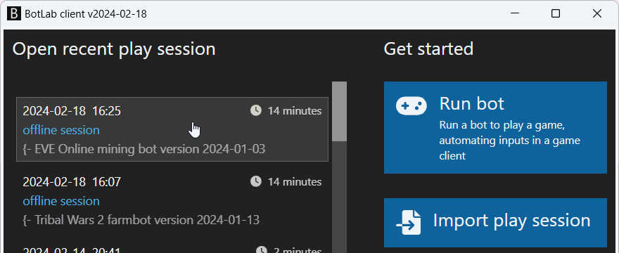
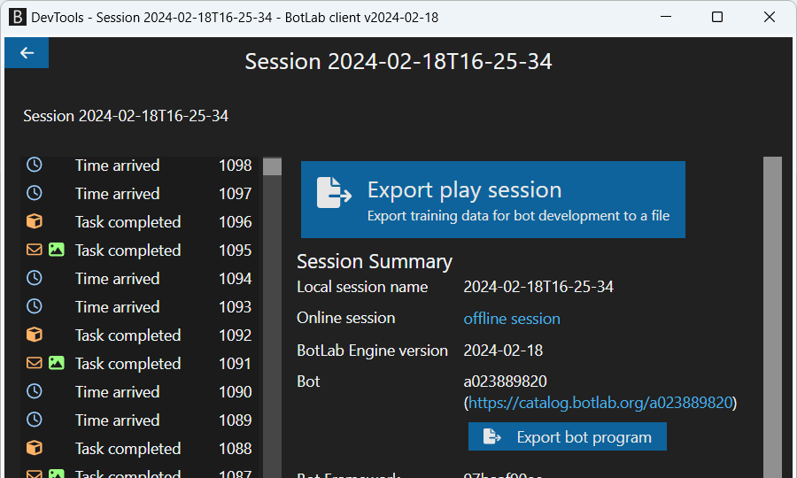

# How to Report an Issue with a Bot or Request a New Feature

Did you see something to improve in a bot?
This guide helps you report bugs and communicate ideas for new features to developers.

Improving a bot starts with identifying a scenario in which we want it to behave differently than it did so far. This approach applies to both fixing bugs and adding features.

These scenarios are the fuel for bot development. Developing bots is an incremental process. A bot evolves as we collect more training data describing the game environment and the desired behavior.

Explaining your use case in human language is a good start, but a developer will usually ask for more data.

## Session Recording and Archive

The most common way to describe the bot's situation is to share a recording of a play session.

The session recording allows us to:

+ See which bot was used in the session and how it was instructed.
+ Travel back in time and see what the bot saw in the past.
+ Understand why the bot did what it did.
+ Create simulation environments to test bot programs: <https://to.botlab.org/guide/testing-a-bot-using-simulated-environments>
+ Collect training data to adapt bot programs to changes in the game world and game clients.

## Exporting a Play Session Recording

How do we get a session recording that we can share with others?

The BotLab client automatically saves a recording for every play session by default. That means saving the session recording is already taken care of unless you choose to deactivate it for that session.

(If you have set the `--detailed-session-recording` switch to `off` on a session, the recording will not be available for that session)

The main menu of the BotLab client shows a list of recent play sessions; we can open any of these for review and further analysis:

By selecting a play session in the main menu, we switch to the tools to explore and analyze that particular session.
To export the play session recording into a transportable zip archive, use the button 'Export play session' above the summary view:

**Note**: After clicking that button, the software might take a few seconds to respond, depending on how many events are in the play session.

Sessions exported this way are saved into the 'Downloads' folder of your Windows user account, with file names like `session-recording-2024-02-18T16-25-34.zip`

With the export, you can share the play session recording like any other file. This way, other people can do an analysis as detailed as necessary. When required, it also enables distilling the training data to adapt the bot to the specifics of your game client.
